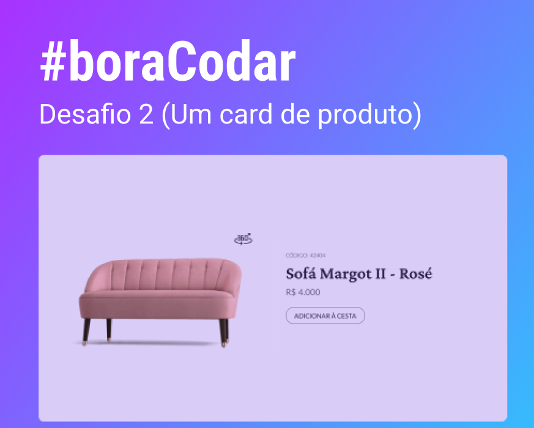
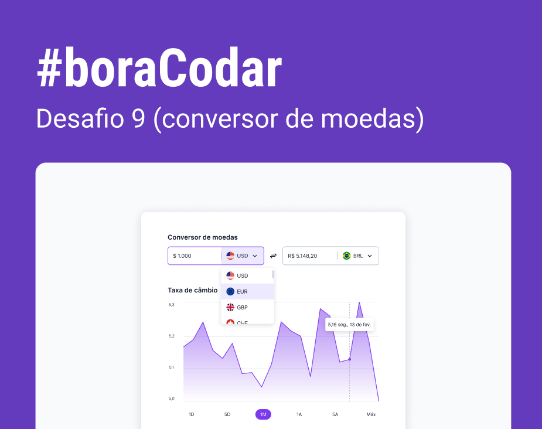
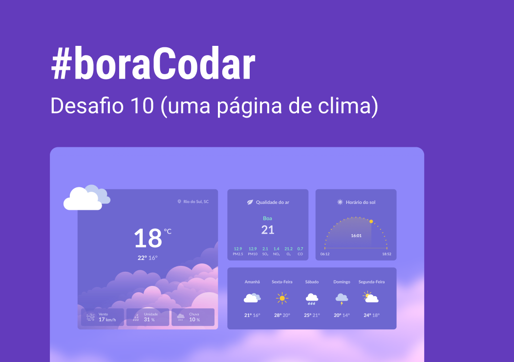
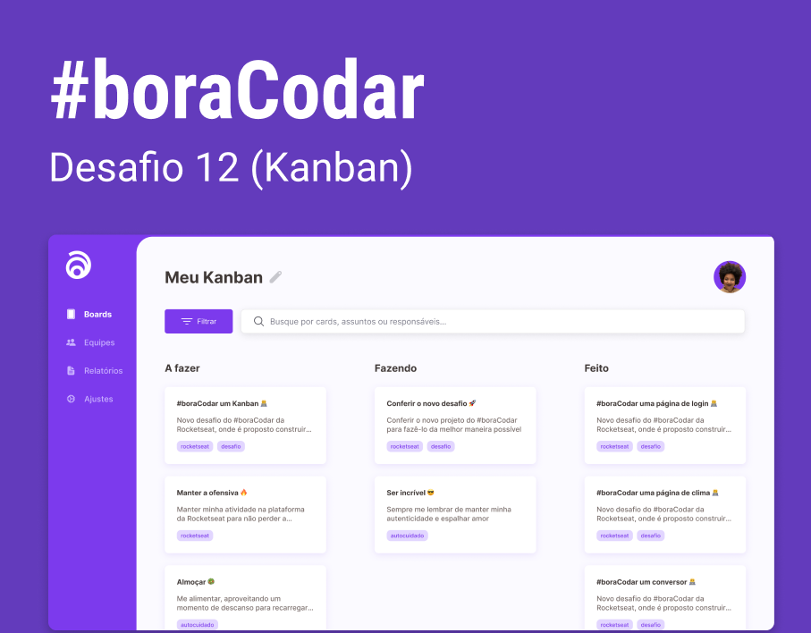
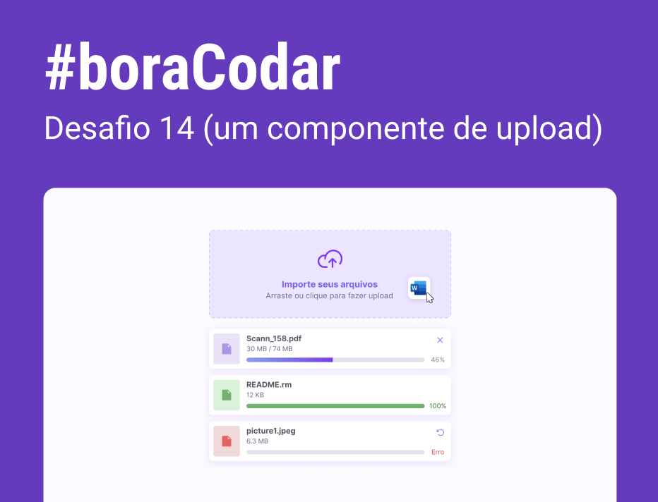
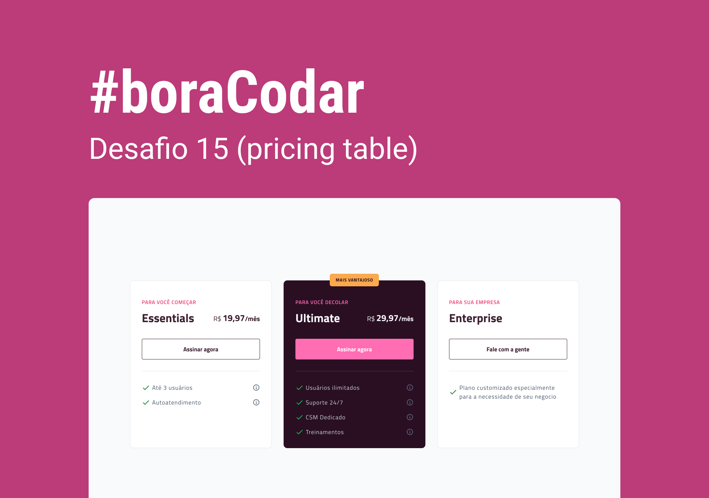
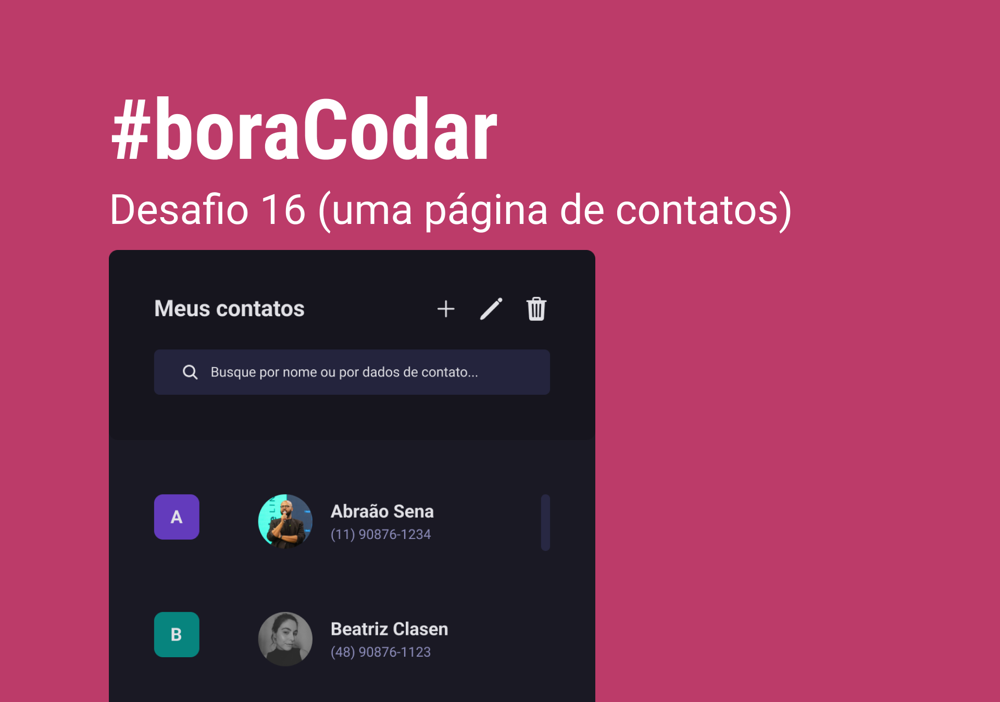
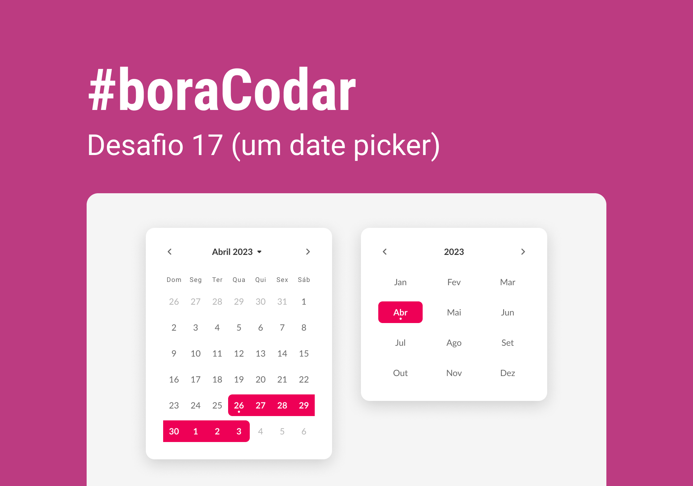

 <h1 align="center"><strong>#boraCodar Projetos Incríveis 👩🏻‍🚀✨</strong></h1>

Esse repositório tem como objetivo armazenar os projetos semanais propostos pela RocketSeat no desafio <strong>#boraCodar</strong>. Nesses desafios, tenho buscado realmente me desafiar e desenvolver meu aprendizado explorando <strong>JavaScript</strong> e <strong>React</strong>. 🚀 

 

    <h3 align="center"><strong>DESAFIOS FEITOS</strong></h3>
    
<a href="https://boracodar.dev">Acesse o desafio desta semana clicando aqui</a> 

     <table align="center">
    <thead >
        <tr>
            <th align="center">
                
                

                    <small>#</small>
                

            </th>
            <th align="center">
                
                

                    <small>
                        NAME
                    </small>
                

            </th>
            <th align="center">
                
                

                    <small>
                    PREVIEW
                    </small>
                

            </th>
        </tr>
    </thead>
    <tbody>
        <tr>
            <td><strong>02</strong></td>
            <td><a href="https://github.com/tthayza/bora-codar/tree/main/02.%20Product-Card"><strong>Product Card</strong></a></td>
            <td align="center"></td>
        </tr>
        <tr>
            <td><strong>03</strong></td>
            <td><a href="https://github.com/tthayza/bora-codar/tree/main/03.%20Buttons-And-Cursors"><strong>Botões e Cursores</strong></a></td>
            <td align="center"></td>
        </tr>
        <tr>
            <td><strong>04</strong></td>
            <td><a href="https://github.com/tthayza/bora-codar/tree/main/04.%20Chat"><strong>Chat</strong></a></td>
            <td align="center"></td>
        </tr>
        <tr>
            <td><strong>05</strong></td>
            <td><a href="https://github.com/tthayza/bora-codar/tree/main/05.%20Calculator"><strong>Calculadora</strong></a></td>
            <td align="center"></td>
        </tr>
        <tr>
            <td><strong>06</strong></td>
            <td><a href="https://github.com/tthayza/bora-codar/tree/main/06.%20Boarding-Pass"><strong>Cartão de embarque</strong></a></td>
            <td align="center" ></td>
        </tr>
        <tr>
            <td><strong>07</strong></td>
            <td><a href="https://github.com/tthayza/bora-codar/tree/main/07.%20Find-Your-Block"><strong>Site para encontrar seu bloco no carnaval</strong></a></td>
            <td align="center" ></td>
        </tr>
        <tr>
            <td><strong>08</strong></td>
            <td><a href="https://github.com/tthayza/bora-codar/tree/main/08.%20Dashboard"><strong>Dashboard de Vendas</strong></a></td>
            <td align="center" ></td>
        </tr>
        <tr>
            <td><strong>09</strong></td>
            <td><a href="https://github.com/tthayza/bora-codar/tree/main/09.%20Currency-Converter"><strong>Conversor de Moedas</strong></a></td>
            <td align="center" ></td>
        </tr>
        <tr>
            <td><strong>10</strong></td>
            <td><a href="https://github.com/tthayza/bora-codar/tree/main/10.%20Weather-Page"><strong>Página de Clima</strong></a></td>
            <td align="center" ></td>
        </tr>
        <tr>
            <td><strong>11</strong></td>
            <td><a href="https://github.com/tthayza/bora-codar/tree/main/11.%20Login-Page"><strong>Página de Login</strong></a></td>
            <td align="center" ></td>
        </tr>
        <tr>
            <td><strong>12</strong></td>
            <td><a href="https://github.com/tthayza/bora-codar/tree/main/12.%20Kanban"><strong>Kanban</strong></a></td>
            <td align="center" ></td>
        </tr>
        <tr>
            <td><strong>13</strong></td>
            <td><a href="https://github.com/tthayza/bora-codar/tree/main/13.%20Forms%20Cart%C3%A3o%20de%20Cr%C3%A9dito"><strong>Forms de Cartão de Crédito</strong></a></td>
            <td align="center" ></td>
        </tr>
        <tr>
            <td><strong>14</strong></td>
            <td><a href="https://github.com/tthayza/bora-codar/tree/main/14.%20Upload%20Component"><strong>Componente de Upload</strong></a></td>
            <td align="center" ></td>
        </tr>
        <tr>
            <td><strong>15</strong></td>
            <td><a href="https://github.com/tthayza/bora-codar/tree/main/15.%20Pricing-Table"><strong>Pricing Table</strong></a></td>
            <td align="center" ></td>
        </tr>
        <tr>
            <td><strong>16</strong></td>
            <td><a href="https://github.com/tthayza/bora-codar/tree/main/16.%20Contacts-Page"><strong>Contacts Page</strong></a></td>
            <td align="center" ></td>
        </tr>
        <tr>
            <td><strong>17</strong></td>
            <td><a href="https://github.com/tthayza/bora-codar/tree/main/17.%20Date-Picker"><strong>Contacts Page</strong></a></td>
            <td align="center" ></td>
        </tr>
        <tr>
            <td><strong>18</strong></td>
            <td><a href="https://github.com/tthayza/bora-codar/tree/main/18.%20Character-Card"><strong>Contacts Page</strong></a></td>
            <td align="center" ></td>
        </tr>
    </tbody>
</table>

<h2 align="center"><strong><a href="https://www.linkedin.com/in/tthayza-oliveira/">Acesse meu perfil no Linkedin aqui</a> </strong></h2>
