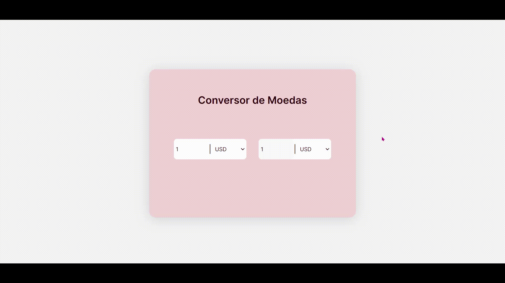

# <h1 align="center"> __#boraCodar um Conversor de Moedas__ 💲 </h1>

#### <h3 align="justify">O objetivo a ser cumprido é programar uma página com o intuito de efetuar conversão de moedas. Fiz utilização de consumo de API contendo 32 moedas, e utilizei alguns Hooks que o React oferece como, <strong>useAffect</strong> e <strong>useState</strong>.</h3>
#

  

#### <h3 align="center"> Esse projeto foi desenvolvido com </h3>
### 
 __HTML | CSS | JavaScript | React__ 

 

### <h3 align="center"> [Acesse meu perfil no Linkedin aqui](https://www.linkedin.com/in/tthayza-oliveira/) </h3>