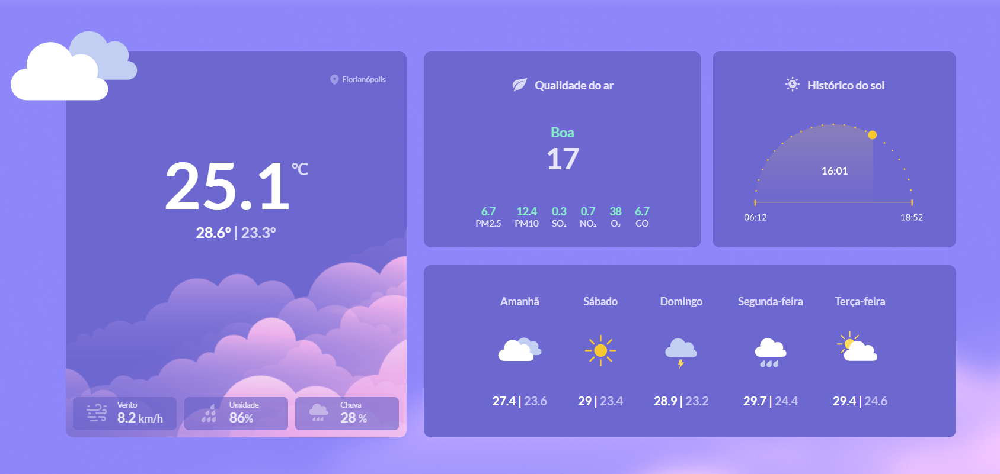

# <h1 align="center"> __#boraCodar uma Página de Clima__ ☁ </h1>

#### <h3 align="justify">O objetivo a ser cumprido é programar uma página que apresente informações metereológicas atuais, e também a previsão para os próximos dias. Sendo assim, fiz consumo de duas API's que para <a href="https://open-meteo.com/en/docs"> informações climáticas </a> e também para apresentar a<a href="https://open-meteo.com/en/docs/air-quality-api#"> qualidade do ar </a>utilizando como base as métricas europeias para essa definição. Continuo explorando e me desafiando fazendo uso do React, e nesse projeto para consumo da API utilizei <strong>useAffect</strong> e <strong>useState</strong>.</h3>
#

  

#### <h3 align="center"> Esse projeto foi desenvolvido com </h3>
### 
 __HTML | CSS | JavaScript | React__ 

 

### <h3 align="center"> [Acesse meu perfil no Linkedin aqui](https://www.linkedin.com/in/tthayza-oliveira/) </h3>