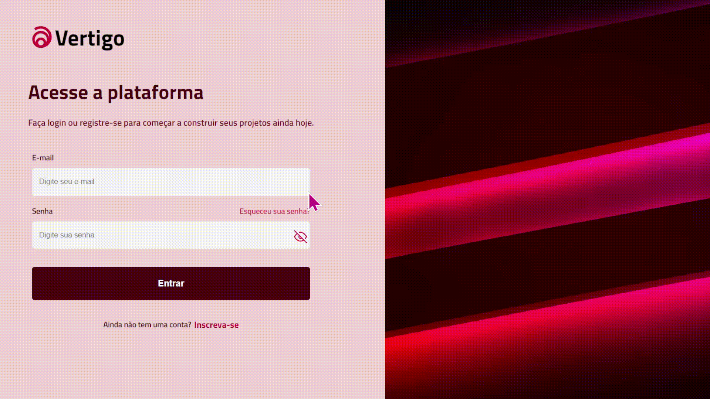

# <h1 align="center"> __#boraCodar uma Página de Login__ ✔ </h1>

#### <h3 align="justify"> O intuito desse projeto é programar uma página de Login que apresentasse entradas de e-mail e senha. Sendo assim, utilizei o _Hook __UseState___ do React.Js para fazer alterações de visibilidade da senha e também para verificar se o e-mail digitado está de acordo com o esperado. Além disso, fiz alterações de cores no projeto do Figma para que pudesse ficar de acordo com meu gosto pessoal. </h3>
#
<h3 align="center"><strong>Você pode conferir esse projeto <a href="https://login-page-black-phi.vercel.app/">clicando aqui</a></strong>! </h3>

#

  

#### <h3 align="center"> Esse projeto foi desenvolvido com </h3>
### 
 __HTML | CSS | JavaScript | React | Figma | Git | GitHub__ 

 

### <h3 align="center"> [Acesse meu perfil no Linkedin aqui](https://www.linkedin.com/in/tthayza-oliveira/) </h3>