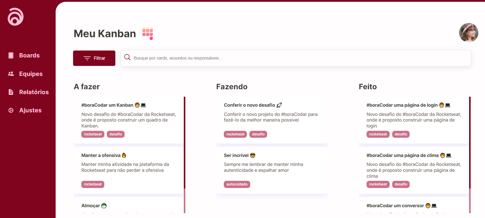

# <h1 align="center"> **#boraCodar um Kanban** 📋 </h1>

#### <h3 align="justify"> A finalidade desse desafio é desenvolver um Kanban que é uma metodologia ágil na qual é organizada em 3 colunas de tarefas, sendo elas: tarefas a fazer, tarefas que estão em execução e tarefas já concluídas. Essa página ainda conta com um filtro de pesquisa que filtra o texto digitado no campo de input, pela descrição, pelo título da tarefa e pelas tags. Para o desenvolvimento foi utilizado utilizei o _Hook_ **UseState** para setar o valor do input e também para setar as tarefas filtradas a partir do valor digitado no input. Além disso, recentemente aprendi o conceito de **Destructuring Props** e coloquei em prática nesse projeto.</h3>

#

<h3 align="center"><strong>Você pode conferir esse projeto <a href="https://my-kanban-six.vercel.app/">clicando aqui</a></strong>! </h3>

#

  

#### <h3 align="center"> Esse projeto foi desenvolvido com </h3>

### 
 **HTML | CSS | JavaScript | React | Figma | Git | GitHub** 

 

### <h3 align="center"> [Acesse meu perfil no Linkedin aqui](https://www.linkedin.com/in/tthayza-oliveira/) </h3>
