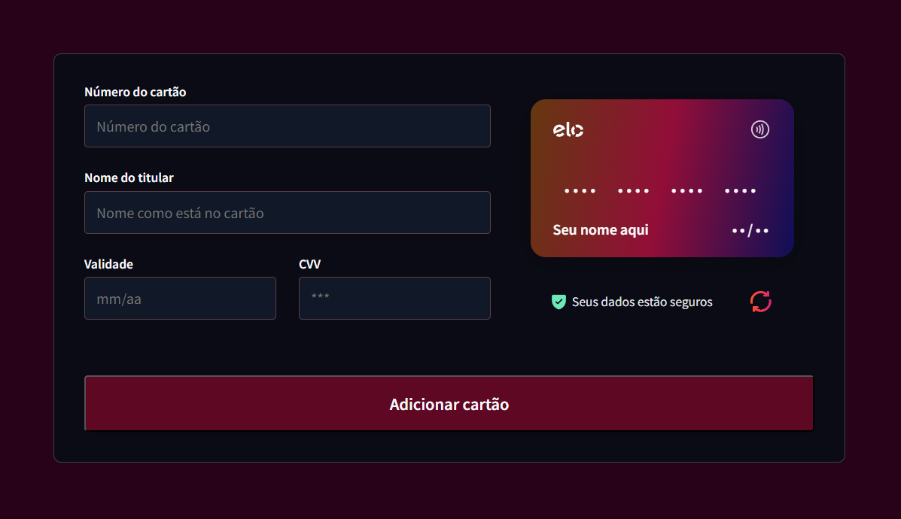

# <h1 align="center"> **#boraCodar um Forms de Cartão de Crédito** 💳 </h1>

<h2><strong>Proposta </strong></h2>
<p align="justify"> A proposta inicial desse desafio é desenvolver um formulário contendo os seguintes inputs: número do cartão de crédito, nome do titular, data de expiração e o código de verificação do cartão (CVV), mostrando também a aparência do cartão de crédito contendo essas informações extraídas dos inputs junto ao botão de adicionar o cartão informado. </p>

<h2> <strong>Resolução</strong>  </h2>
<p align="justify"> Para resolucionar esse desafio, fiz a criação do componente cartão de crédito que é o modelo visual de um cartão de crédito visto na tela. Através do uso de <strong>props</strong> que recebem os valores de input por meio do <strong>onChange</strong> e além de mostrar diretamente nos inputs o que o usuário digita, também os mostra diretamente no componente cartão de crédito. Foram necessárias algumas formatações dos dados passados para que ficasse de acordo com o protótipo do projeto. <br> Além disso, a bandeira do cartão muda a depender do primeiro dígito informado na entrada da informação. Para completar, implementei como uma nova funcionalidade: o botão que rotaciona o cartão de crédito para que se visualize tanto a parte frontal do cartão, quanto a parte de trás.</p>

<br>

<h3 align="center"><strong>Você pode conferir esse projeto <a href="https://forms-credit-card.vercel.app//">clicando aqui</a></strong>! </h3>

<br>

<p align="center">
  
</p>

<h2> <strong> Aprendizados </strong> <h2>
<ul>
  <li><strong> OnFocus:</strong> Assim que o input de CVV recebe o focus, é chamada instantaneamente a função que rotaciona o cartão, podendo assim visualizar automaticamente o que está sendo digitado. </li>
<li> Método match(): Utilizado para dividir as informações passadas por props, como o número de cartão de crédito e data de expiração. </li>
<li> MaxLength: Atributo usado para delimitar o campo de input. </li>
<li> Estilização do placeHolder: No CSS, aprendi que é possível implementar estilos diretamente no placeHolder do input, da seguinte maneira: </li>
<li> Aprimoramento de inglês técnico.</li>

```CSS
.className[placeHolder] {
  color: gray;
}
```
#

#### <h3 align="center"> Esse projeto foi desenvolvido com </h3>

### <p align="center"> **HTML | CSS | JavaScript | React | Figma | Git | GitHub** </p>


### <h3 align="center"> [Acesse meu perfil no Linkedin aqui](https://www.linkedin.com/in/tthayza-oliveira/) </h3>
