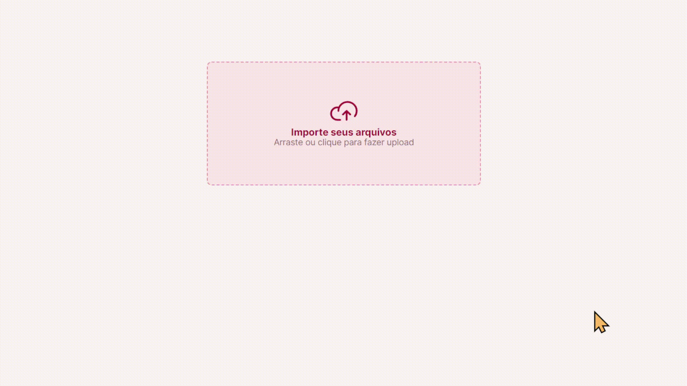

# <h1 align="center"> **#boraCodar um Componente de Upload** 📁 </h1>

<h2><strong>Proposta </strong></h2>

 A proposta inicial desse desafio é desenvolver uma página na qual seja possível fazer import de arquivos, mostrando abaixo o carregamento desse arquivo contendo informações como: nome do arquivo e tamanho podendo então, excluí-lo.

<h2> <strong>Resolução</strong>  </h2>

 Para resolucionar esse desafio, fiz a criação do componente File que conta com as informações do arquivo, uma imagem que simula o estado atual do arquivo (se foi carregado ou o carregamento está em processo). Utilizei o hook <strong>useEffect</strong> para fazer o rastreamento e atualização da porcentagem, que é o que define a largura da barra de progresso. Além disso, para modificar a cor da barra e texto da porcentagem foi utilizado o hook <strong>UseState</strong> que faz essa definição de acordo com a atualização do intervalo definido no UseEffect. Clicando no ícone de "X" o componente File é excluído da área de arquivos, e ao clicar na área de importar arquivo, o componente File é chamado para a área de arquivos.

 

  

#

#### <h3 align="center"> Esse projeto foi desenvolvido com </h3>

### 
 **HTML | CSS | JavaScript | React | Figma | Git | GitHub** 

### <h3 align="center"> [Acesse meu perfil no Linkedin aqui](https://www.linkedin.com/in/tthayza-oliveira/) </h3>
