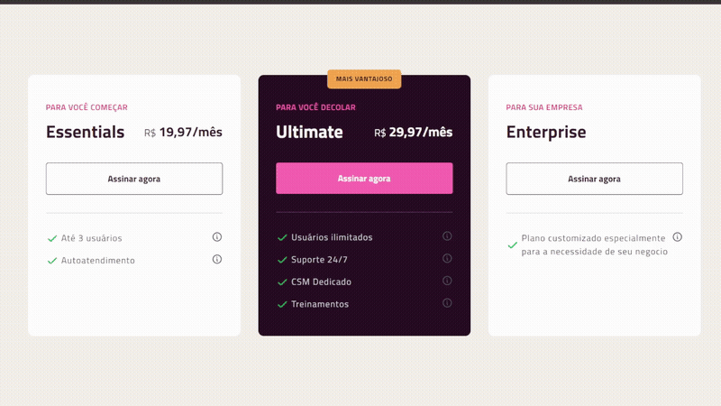

# <h1 align="center"> **#boraCodar um Pricing Table** 💲 </h1>

<h2><strong>Proposta </strong></h2>

 A proposta inicial desse desafio é desenvolver uma simulação de uma tabela de preço, como de um plano. Dentro dessa tabela, existem três tipos de planos, que contém informações referente a quem se destina determinado plano, seu valor e informações adicionais como sendo, os benefícios de cada um e ainda destacando qual plano seria mais vantajoso. 

<h2> <strong>Resolução</strong>  </h2>

 Para resolucionar esse desafio, fiz a criação do componente <strong>Table</strong> que contém exatamente o que cada plano deve ter, nesse caso: um título, vantagens, preço e para quem se destina. Por meio do uso de <strong>props</strong> que são passadas na chamada do componente, é possível então setar o conteúdo dos campos que devem ser preenchidos em cada componente com o mesmo estilo mas com conteúdo diferente. Além disso, por haver um componente em destaque (com estilo diferente), fiz verificações utilizando o operador ternário para poder controlar essas modificações. Para a transformação de escala de cada componente, utilizei um dos hooks do React, que é o <strong>useState</strong> no qual, é 'setado' em funções que o evento <strong>onMouseEnter</strong> e <strong>onMouseLeave</strong> chamam.

 

  

<h2> <strong> Aprendizados </strong> <h2>
<ul>
  <li>
    
<strong> onMouseEnter:</strong> Evento que ocorre quando o mouse está dentro do componente. Foi atribuído um callback que chama a função que seta o valor true para a função que faz essa alteração, que em consequência disso, seta a classe que faz animação de scale no CSS.

  </li>
  <li>
    
<strong> onMouseLeave:</strong> Evento que ocorre quando o mouse sai do componente, atribuído um callback que chama a função que altera o valor para false. Sendo assim, o scale deixa de ocorrer.

  </li>
  <li>
    
 Aprimoramento de inglês técnico. 

  </li>
</ul>

#

#### <h3 align="center"> Esse projeto foi desenvolvido com </h3>

### 
 **HTML | CSS | JavaScript | React | Figma | Git | GitHub** 

### <h3 align="center"> [Acesse meu perfil no Linkedin aqui](https://www.linkedin.com/in/tthayza-oliveira/) </h3>
