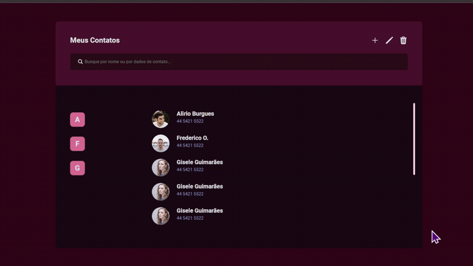

# <h1 align="center"> **#boraCodar uma Página de Contatos** 💲 </h1>

<h2><strong>Proposta </strong></h2>

 A proposta inicial desse desafio é desenvolver uma página de contatos. Nesse contexto, deve haver uma lista de contatos identificados por imagem, nome e telefone, um filtro de busca e como numa agenda, os contatos devem estar organizados alfabeticamente, sendo que a letra inicial deve estar também exposta.

<h2> <strong>Resolução</strong>  </h2>

 Para resolucionar esse desafio, fiz a criação do componente <strong>Contact</strong> e também <strong>Header</strong>. O Contact possui como características a letra inicial fixada ao lado esquerdo da página, e do lado de direito estão organizados as informações a respeito do contato. Caso já tenha um contato anterior com a mesma inicial do contato atual, então a letra inicial do lado esquerdo se torna invisível. Já o componente Header, tem como característica principal o filtro de busca, que ao pesquisar por um determinado nome e ao pressionar a tecla ENTER do teclado, os contatos correspondentes ao que foi digitado serão mostrados. A organização dos contatos foi feita da seguinte forma: cada contato é um objeto, tendo como propriedades: imagem, nome e telefone, cada um desses se localizam dentro de um array. O hook <strong>useState</strong> foi utilizado para atualizar o estado do que é escrito no input, e também o método <strong>filter()</strong> e <strong>includes()</strong> para filtrar o que foi digitado se está incluso na propriedade nome de algum objeto existente.

 

  

<h2> <strong> Aprendizados </strong> <h2>
<ul>
  <li>
    
<strong> onKeyDown:</strong> Evento que ocorre quando uma tecla do teclado é pressionada. Para o caso desse projeto, fiz uma verificação para saber se a tecla pressionada é, de fato, a tecla enter através de uma arrowFunction o mouse está dentro do componente. 

  </li>
  <li>
    
 Aprimoramento de inglês técnico. 

  </li>
</ul>

#

#### <h3 align="center"> Esse projeto foi desenvolvido com </h3>

### 
 **HTML | CSS | JavaScript | React | Figma | Git | GitHub** 

### <h3 align="center"> [Acesse meu perfil no Linkedin aqui](https://www.linkedin.com/in/tthayza-oliveira/) </h3>
