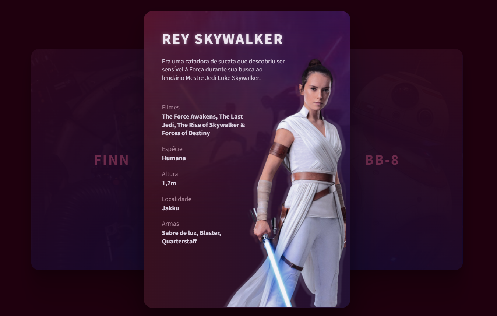

# <h1 align="center"> **#boraCodar um Card de Personagem** 💫 </h1>

<h2><strong>Proposta </strong></h2>

 A proposta inicial desse desafio é desenvolver uma página que contenha 3 cards diferentes de personagens, ao centro o card principal deve conter as informações do personagem e a foto do mesmo, enquanto que ao lado esquerdo e direito devem conter cards virados para trás. 

<h2> <strong>Resolução</strong>  </h2>

 Para resolucionar esse desafio, fiz a criação do componente <strong>Card</strong> onde organizei todas as informações que o personagem deve ter, que nesse caso, seriam: o título do personagem, uma breve biografia, filmes em que este personagem está, sua espécie, altura, localidade e suas armas. Além disso, sua imagem foi posicionada ao lado direito do card. Para a organização de suas informações adicionais, utilizei a tag de lista do HTML. Em adição a isto, incrementei efeito ao passar o mouse sobre cada card <strong>(hover)</strong>, no qual se forma um <strong>box-shadow</strong> e também o card aumenta seu tamanho.

 

  

<h2> <strong> Aprendizados </strong> <h2>
<ul>
  <li>
    
 Aprimoramento de inglês técnico. 

  </li>
</ul>

#

#### <h3 align="center"> Esse projeto foi desenvolvido com </h3>

### 
 **HTML | CSS | JavaScript | React | Figma | Git | GitHub** 

### <h3 align="center"> [Acesse meu perfil no Linkedin aqui](https://www.linkedin.com/in/tthayza-oliveira/) </h3>
