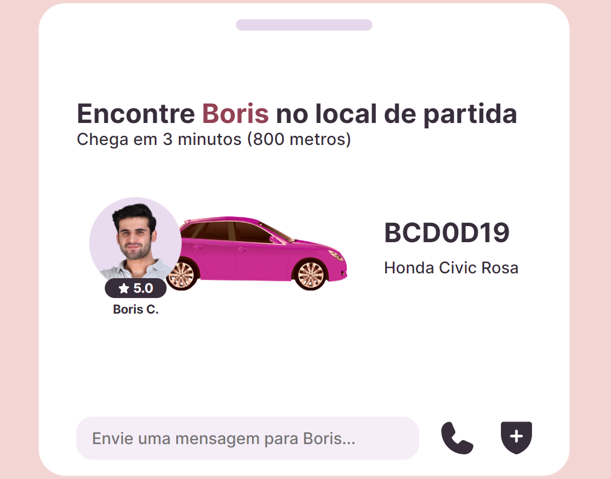

# <h1 align="center"> **#boraCodar um Widget de Transporte** 🚘 </h1>

<h2><strong>Proposta </strong></h2>

 O objetivo inicial desse desafio é desenvolver uma tela que contenha informações referentes a um pedido de transporte de carro, tais informações são do motorista, seu carro, tempo de chegada e também formas de entrar em contato.

<h2> <strong>Resolução</strong>  </h2>

 Para resolucionar esse desafio, a princípio decidi fazer diretamente no arquivo App sem utilização de componentes, fiz alterações nas cores do protótipo do projeto. Além disso, para trabalhar com posicionamento da seção onde ficam alocadas as informações do motorista, foi muito útil fazer uso da propriedade <strong>position</strong> com valor <strong> absolute</strong> e também trabalhei com a propriedade <strong>z-index</strong> para manipular a sobreposição de determinados elementos como a foto do motorista e o elemento de classificação de estrelas. Em adição a isto, adicionei efeitos <strong>hover</strong> que mudam a escala, rotacionam e alteram opacidade em alguns elementos.  

 

  

<h2> <strong> Aprendizados </strong> <h2>
<ul>
  <li>
    
 Aprimoramento de inglês técnico. 

  </li>
</ul>

#

#### <h3 align="center"> Esse projeto foi desenvolvido com </h3>

### 
 **HTML | CSS | JavaScript | React | Figma | Git | GitHub** 

### <h3 align="center"> [Acesse meu perfil no Linkedin aqui](https://www.linkedin.com/in/tthayza-oliveira/) </h3>
