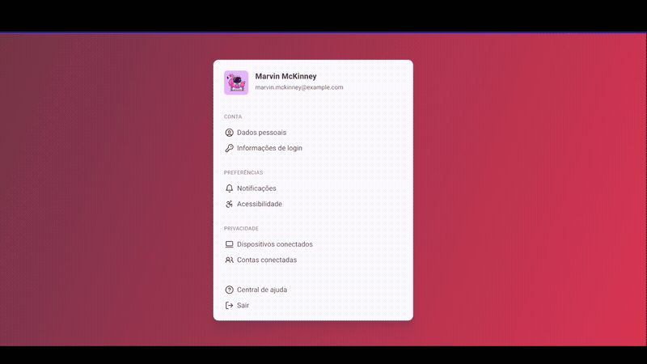

# <h1 align="center"> **#boraCodar um Componente de Profile Settings** ⚙ </h1>

<h2><strong>Proposta </strong></h2>

 O objetivo inicial desse desafio é desenvolver uma interface que inclua informações de configurações básicas de uma conta de um usuário.

<h2> <strong>Resolução</strong>  </h2>

 Para resolucionar esse desafio, resolvi organizar a aba de configurações como sendo um componente que inclui cada item de configuração como também um componente. Sendo assim, foram criados os componentes de <strong>Settings</strong> e <strong>Item</strong> que contém a informação de qual configuração se trata e seu respectivo ícone. Dessa vez, decidi utilizar a biblioteca de icons <a href='https://lucide.dev/' target='_blank'>lucide </a> e organizei cada ícone em um objeto e a cada chamada de um item é passado por <strong>props </strong> o valor do ícone que se localiza dentro do objeto. Além disso, adicionei efeito hover em cada item, nos quais altera a cor de background e muda a visibilidade para 'visible' da seta para ter acesso àquela configuração. 

 

  

<h2> <strong> Aprendizados </strong> <h2>
<ul>
  <li>
    
 Aprimoramento de inglês técnico. 

  </li>
  <li>
    
 Utilização da lib lucide para ícones. 

  </li>
</ul>

#

#### <h3 align="center"> Esse projeto foi desenvolvido com </h3>

### 
 **HTML | CSS | JavaScript | React | Figma | Git | GitHub** 

### <h3 align="center"> [Acesse meu perfil no Linkedin aqui](https://www.linkedin.com/in/tthayza-oliveira/) </h3>
