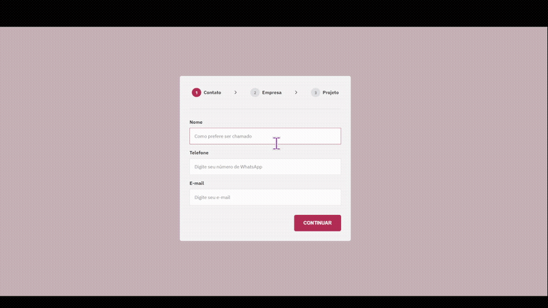

# <h1 align="center"> **#boraCodar um Formulário Multi-Step** 📝 </h1>

<h2><strong>Proposta </strong></h2>

 O objetivo inicial desse desafio é desenvolver um formulário que contenha, nesse caso, 3 passos ou 3 formulários. Em cada um dos formulários deve conter um botão para avançar ou voltar se for a partir do segundo formulário, e clicando nesse botão deve-se avançar para o próximo formulário ou voltar ao formulário anterior. Além disso, a parte do cabeçalho deve acompanhar essas mudanças de avançar e voltar.

<h2> <strong>Resolução</strong>  </h2>

 Para resolucionar esse desafio, a princípio fiz alterações nas cores no protótipo do projeto, e resolvi organizar toda a tela em componentes, sendo assim foram criados os componentes de <strong>Formulário de Contato, Formulário da Empresa </strong> e <strong> Formulário do projeto</strong> que se diferenciam por seus valores nos inputs, placeholders e também por utilizar área de texto ao invés de input. Além disso, para tornar ainda mais reutilizável esse desafio, tornei o campo do input incluindo a label em um componente <strong>Input</strong> e também foi criado o componente <strong>Header</strong> que corresponde ao cabeçalho que atualiza em que passo ou formulário o usuário está atualmente, podendo ser o primeiro, segundo ou terceiro. Foi utilizado principalmente nesse projeto, o hook do React <strong>useState</strong> para gerenciar os estados das cores do texto e background do texto no cabeçalho por exemplo. E também utilizei o conceito de props, utilizando juntamente o destructuring assignment para passar funções que partem para o próximo formulário ou retornam ao formulário anterior ao clicar em determinado botão. Em adição a tudo isso, adicionei efeitos hover indicados no protótipo.

 

  

<h2> <strong> Aprendizados </strong> <h2>
<ul>
  <li>
    
 Aprimoramento de inglês técnico; 

  </li>
  <li>
    
 Evolução no desenvolvimento de lógicas. Como, por exemplo: utilização do operador <strong>&&</strong>; 

  </li>
  <li>
    
 Estilização da área de texto; 

  </li>
  <li>
    
 Melhor compreensão na divisão de componentes. 

  </li>
</ul>

#

#### <h3 align="center"> Esse projeto foi desenvolvido com </h3>

### 
 **HTML | CSS | JavaScript | React | Figma | Git | GitHub** 

### <h3 align="center"> [Acesse meu perfil no Linkedin aqui](https://www.linkedin.com/in/tthayza-oliveira/) </h3>
