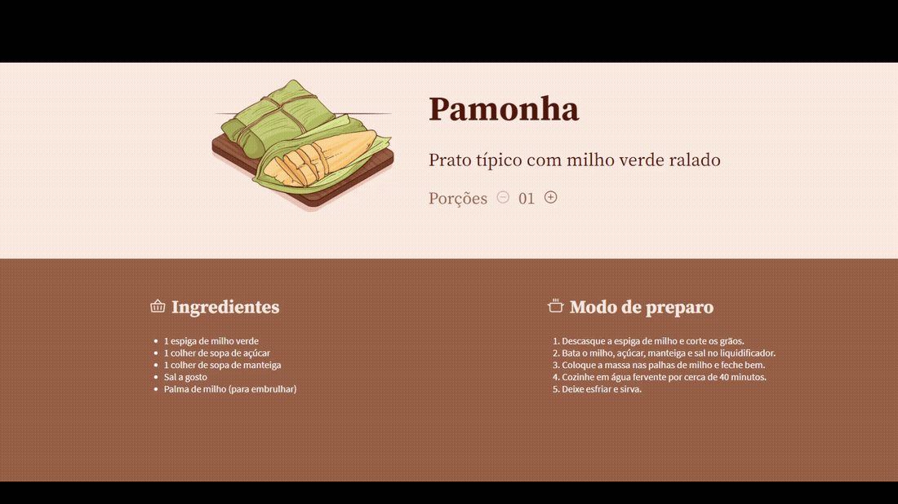

# <h1 align="center"> **#boraCodar uma receita junina** 🌽</h1>

<h2><strong>Proposta </strong></h2>

 O objetivo desse desafio é desenvolver uma interface na qual representa uma receita de festa junina, nesse caso, a receita da pamonha. Sendo assim, em uma receita deve conter a apresentação dos ingredientes necessários para que ela seja feita e também seu modo de preparo. Em adição, essa página possui a representação em imagem da receita e também uma breve descrição, além de poder fazer o controle da quantidade de porções dinamicamente. 

<h2> <strong>Resolução</strong>  </h2>

 Para a resolução desse desafio super divertido, utilizei o ReactJs e seu incrível hook <b>useState()</b> que me permitiu manipular a quantidade de porções clicando nos botões de aumentar e diminuir passando essa informação por meio de props para outro componente, onde estão organizados os ingredientes. Além disso, foram feitas pequenas validações para que a string esteja de acordo com a quantidade e também há o bloqueio do botão de diminuir a quantidade de porções quando o valor atual da quantidade de porções é 1. Para finalizar, foram adicionados hover effects nos botões mudando sua escala e opacidade, e utilizei dessa vez a lib <a href='https://github.com/phosphor-icons/react'>Phosphor-Icons</a> para importar os ícones.  

 

  

<h2> <strong> Aprendizados </strong> <h2>
<ul>
  <li>
    
 Aprimoramento de inglês técnico; 

  </li>
  <li>
    
 Utilização de uma nova lib para importar icons. 

  </li>
  <li>
    
 Atributo disabled. 

  </li>
  <li>
    
 Cursor not allowed. 

  </li>

</ul>

#

#### <h3 align="center"> Esse projeto foi desenvolvido com </h3>

### 
 **HTML | CSS | JavaScript | React | Figma | Git | GitHub** 

### <h3 align="center"> [Acesse meu perfil no Linkedin aqui](https://www.linkedin.com/in/tthayza-oliveira/) </h3>
