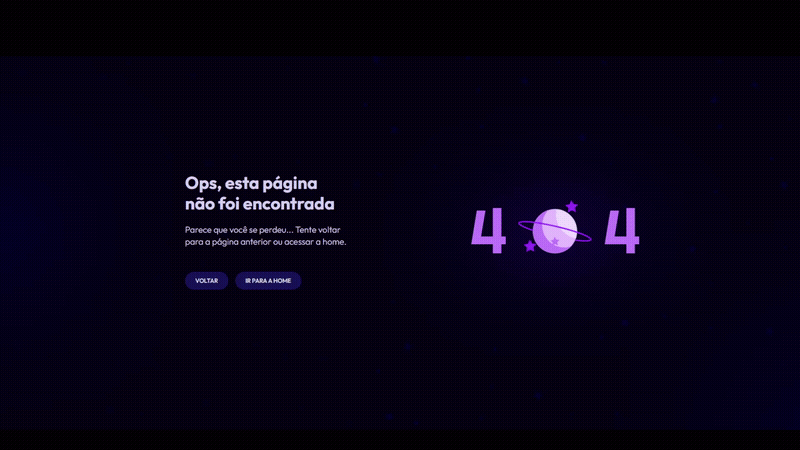

# <h1 align="center"> **#boraCodar uma página de erro** ❌</h1>

<h2><strong>Proposta </strong></h2>

 A proposta desse desafio é desenvolver uma página de erro que descreve breves instruções para o usuário que está em uma página de erro cujo código é 404. Além disso, no texto 404 o número 0 é substituído por uma gif de um planeta. 

<h2> <strong>Resolução</strong>  </h2>

 Para a resolução desse desafio, utilizei o ReactJs e organizei a página utilizando o flexbox com o direção row-reverse para telas maiores e para telas menores utilizei a direção em column. Em adição a isto, o planeta substituído pelo número 0 foi utilizado por meio da tag iframe fornecida no protótipo do projeto. Para finalizar foram adicionados efeitos hover seguindo o projeto e adicionei drop-shadow para deixar ainda melhor! 

 

  

<h2> <strong> Aprendizados </strong> <h2>
<ul>
  <li>
    
 Aprimoramento de inglês técnico; 

  </li>
  <li>
    
 Utilização e melhor entendimento do drop-shadow; 

  </li>
  <li>
    
 Utilização de row-reverse, melhor entendimento para necessidade de cada tamanho de tela. 

  </li>

</ul>

#

#### <h3 align="center"> Esse projeto foi desenvolvido com </h3>

### 
 **HTML | CSS | JavaScript | React | Figma | Git | GitHub** 

### <h3 align="center"> [Acesse meu perfil no Linkedin aqui](https://www.linkedin.com/in/tthayza-oliveira/) </h3>
