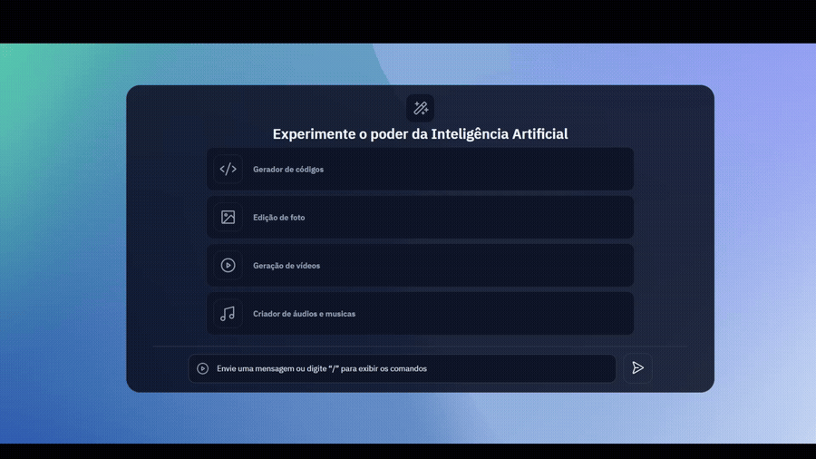

# <h1 align="center"> **#boraCodar uma plataforma de IA** 🧠</h1>

<h2><strong>Proposta </strong></h2>

Desenvolver uma homepage de uma plataforma de IA, que possua algumas opções de interação como gerar códigos, editar fotos entre outras funções em que uma IA possa ser útil. 

<h2> <strong>Resolução</strong>  </h2>

 Para cumprir esse desafio, o desenvolvi em ReactJs e organizei a página com os componentes Header, Footer e Option. Sendo assim, o <b>Header</b> contém as informações de cabeçalho com título e ícone principal, o componente <b>Footer</b> engloba a seção de input enquanto o componente <b>Option</b> refere-se a cada função da IA, sendo dessa forma reaproveitado algumas vezes. Além disso, apliquei efeitos hover nos ícones e no componente Option, e acrescentei uma animação com CSS ao passar o mouse pela arrow de cada opção.  

 

  

<h2> <strong> Aprendizados </strong> <h2>
<ul>
  <li>
    
 Aprimoramento de inglês técnico; 

  </li>
  <li>
    
 Melhor entendimento de animações com CSS; 

  </li>

</ul>

#

#### <h3 align="center"> Esse projeto foi desenvolvido com </h3>

### 
 **HTML | CSS | JavaScript | React | Figma | Git | GitHub** 

### <h3 align="center"> [Acesse meu perfil no Linkedin aqui](https://www.linkedin.com/in/tthayza-oliveira/) </h3>
