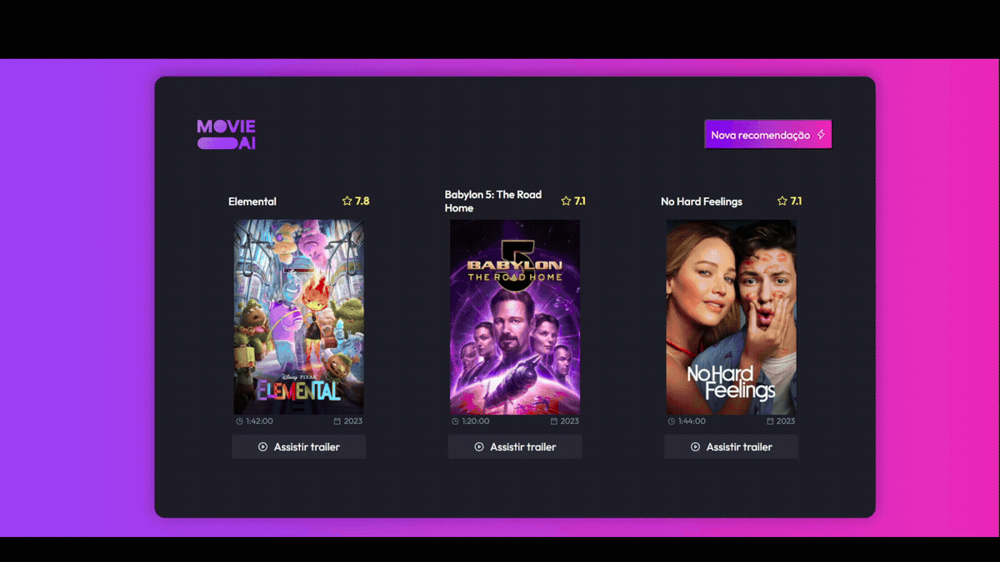

# <h1 align="center"> **#boraCodar um recomendador de filmes** 🎬🍿</h1>

<h2><strong>Proposta </strong></h2>

Desenvolver uma interface que contenha informações de filmes recomendados para o usuário, deve haver três cards com informações de cada filme como: nome, poster, tempo de filme, entre outras. A ideia é que ao clicar no botão 'Nova Recomendação', outros 3 novos filmes sejam renderizados na tela. 

<h2> <strong>Resolução</strong>  </h2>

 Para cumprir esse desafio, o desenvolvi em ReactJs onde criei o componente Card e utilizei a <a  href="https://developer.themoviedb.org/reference/search-movie" target="_blank">TMDB API</a> para trazer informações dinamicamente de cada filme, e clicando no botão de nova recomendação, são feitas as requisições necessárias para renderização dos filmes recomendados. O hook <b>useEffect()</b> e <b>useState()</b> foram fundamentais para a resolução desse desafio, visto que o estado de cada dado requisitado está armazenado em um estado e o useEffect foi importante para a renderização conforme evento de clique ou primeira construção da página.  

 

  

<h2> <strong> Aprendizados </strong> <h2>
<ul>
  <li>
    
 Aprimoramento de inglês técnico; 

  </li>
  <li>
    
 Utilização de uma nova API; 

  </li>
  <li>
    
 Melhor entendimento de assincronismo. 

  </li>

</ul>

#

#### <h3 align="center"> Esse projeto foi desenvolvido com </h3>

### 
 **HTML | CSS | JavaScript | React | Figma | Git | GitHub** 

### <h3 align="center"> [Acesse meu perfil no Linkedin aqui](https://www.linkedin.com/in/tthayza-oliveira/) </h3>
