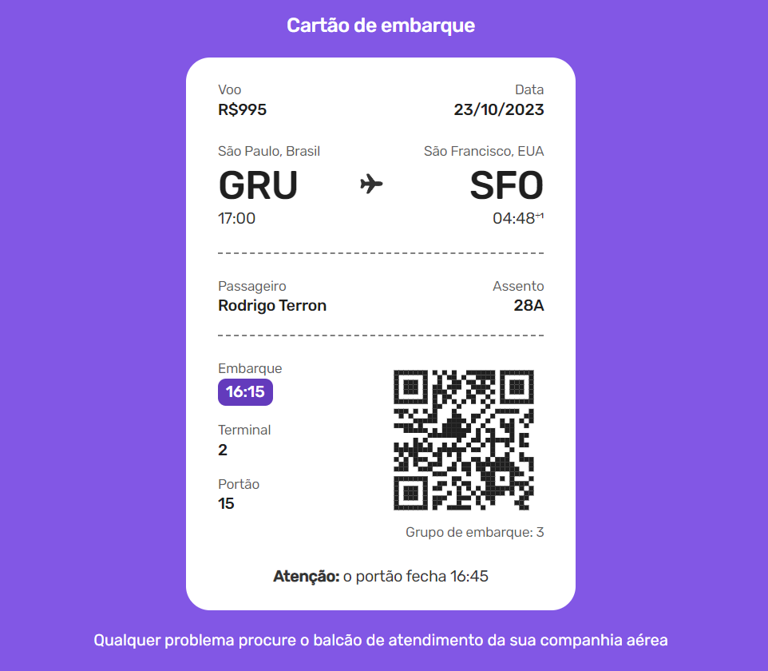

# <h1 style="text-align:center"> __#boraCodar um Cartão de Embarque__ ✈ </h1>

#### <h2 style="text-align:center">O objetivo a ser cumprido foi programar uma passagem de avião com as identificações do passageiro e informações referente ao embarque de determinado voo. </h2>
#

  

#### <h3 style="text-align:center"> Esse projeto foi desenvolvido com </h3>
### 
 __HTML | CSS | JavaScript | React__ 

 

### <h3 style="text-align:center"> [Acesse meu perfil no Linkedin aqui](https://www.linkedin.com/in/tthayza-oliveira/) </h3>