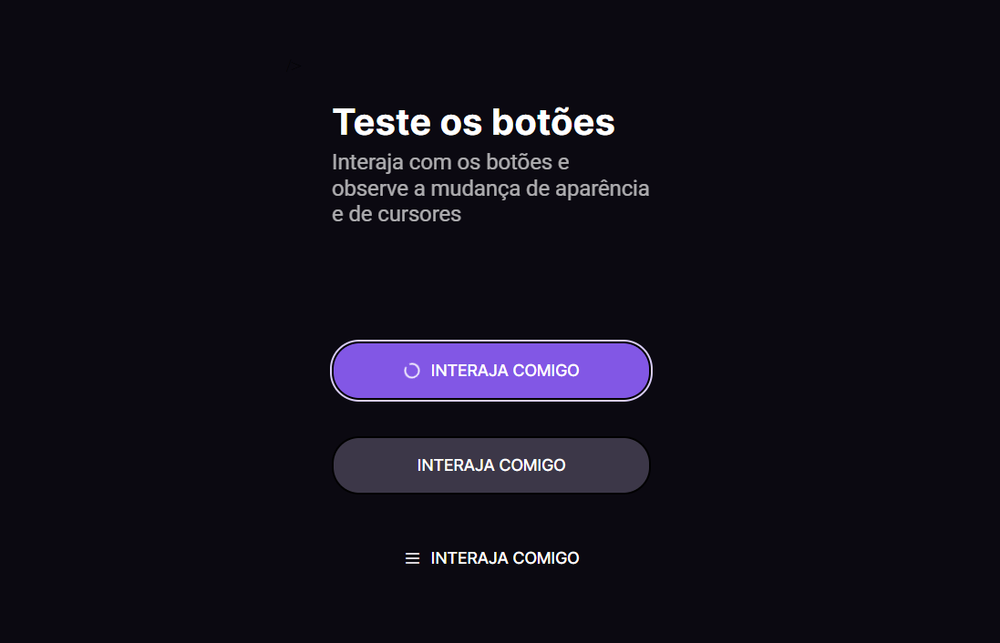

# <h1 style="text-align:center"> __#boraCodar Botões e Cursores__ 🖱</h1>

#### <h3 style="text-align:center">O objetivo desenvolvido foi programar diferentes estados ao interagir com botões em integração com o cursor, como por exemplo: </h3>

 <strong>Hover:</strong> quando o mouse é passado na área do botão;  

<strong>Disabled:</strong> estado em que o mouse está quando desativado;  

<strong>Focus:</strong> quando o botão é selecionado através do teclado;  

<strong>Loading:</strong> estado em que o botão se encontra após o click;  

#

  

#### <h3 style="text-align:center"> Esse projeto foi desenvolvido com </h3>
### 
 __HTML | CSS | JavaScript | Git | GitHub | Figma__ 

 

### <h2 style="text-align:center"> [Acesse meu perfil no Linkedin aqui](https://www.linkedin.com/in/tthayza-oliveira/) </h2>