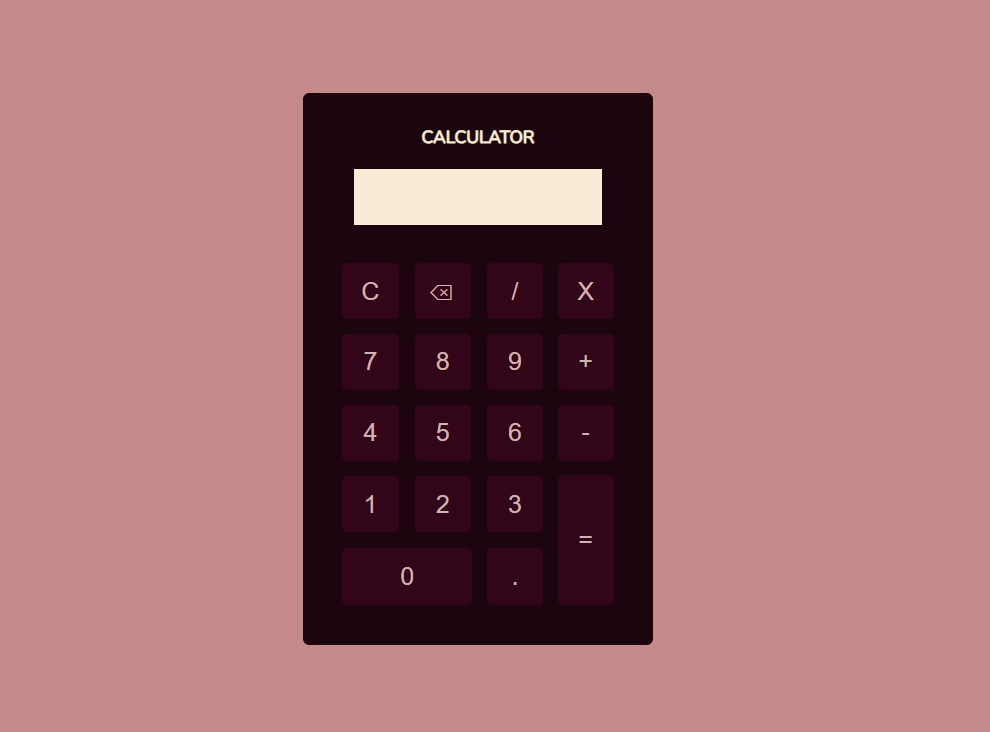

# <h1 style="text-align:center"> __#boraCodar uma Calculadora__ 🔢</h1>

#### <h3 style="text-align:center">O objetivo a ser cumprido foi programar uma calculadora que efetua operações matemáticas simples, mas que funcione da melhor maneira possível. </h3>
#

  

#### <h3 style="text-align:center"> Esse projeto foi desenvolvido com </h3>
### 
 __HTML | CSS | JavaScript | Git | GitHub__

 

### <h2 style="text-align:center"> [Acesse meu perfil no Linkedin aqui](https://www.linkedin.com/in/tthayza-oliveira/) </h2>