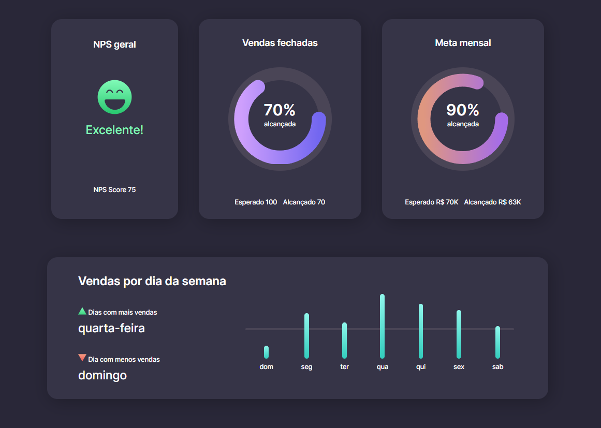

# <h1 align="center"> __#boraCodar um Dashboard de Vendas__ 📊 </h1>

#### <h2 align="center">O objetivo a ser cumprido foi programar painel de vendas que demonstrasse dados alcançados e esperados, incluindo diferentes tipos de gráficos como o estilo donut e de colunas. </h2>
#### 
 __Algumas particularidades nesse projeto:__ Na organização optei por utilizar a conceituação de componentes para fazer apenas um componente que englobasse o quadro de vendas fechadas e meta mensal manipulando as _props_ para diferenciar um quadro do outro. Além disso, também fiz uso do __CSS-Animation__ para animar os gráficos de donut em conjunto com a função __setInterval__ em JavaScript que faz o controle da porcentagem alcançada.

#

  

#### <h3 align="center"> Esse projeto foi desenvolvido com </h3>
### 
 __HTML | CSS | JavaScript | React__ 

 

### <h3 align="center"> [Acesse meu perfil no Linkedin aqui](https://www.linkedin.com/in/tthayza-oliveira/) </h3>