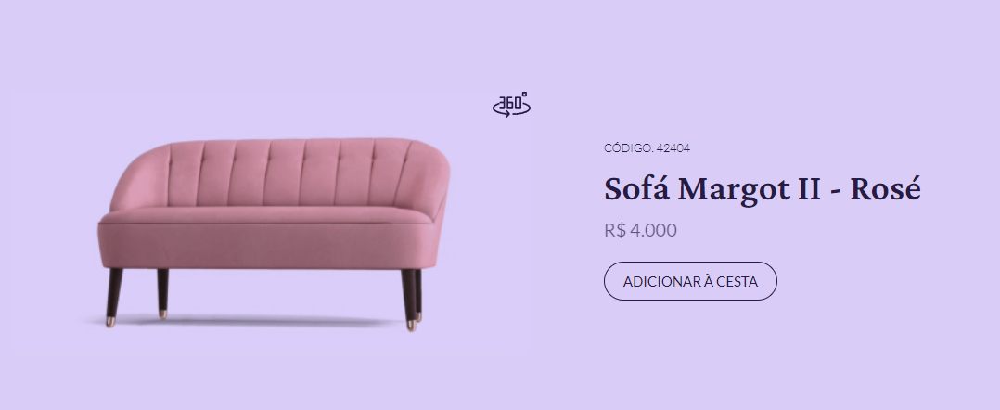

# <h1 align="center">__#boraCodar um Card de Produto 🛋__</h1>
#### <h3 align="center">A funcionalidade do projeto é demonstrar um produto através de uma imagem estática e uma imagem animada rotativa em 360º ao clicar no botão. Além disso, também contém o detalhamento do produto, como: o valor e código do produto. </h3>
#

  

#### <h3 align="center"> Esse projeto foi desenvolvido com </h3>
### 
 __HTML | CSS | JavaScript | Git | GitHub | Figma__

 

### <h2 align="center"> [Acesse meu perfil no Linkedin aqui](https://www.linkedin.com/in/tthayza-oliveira/) </h2>

